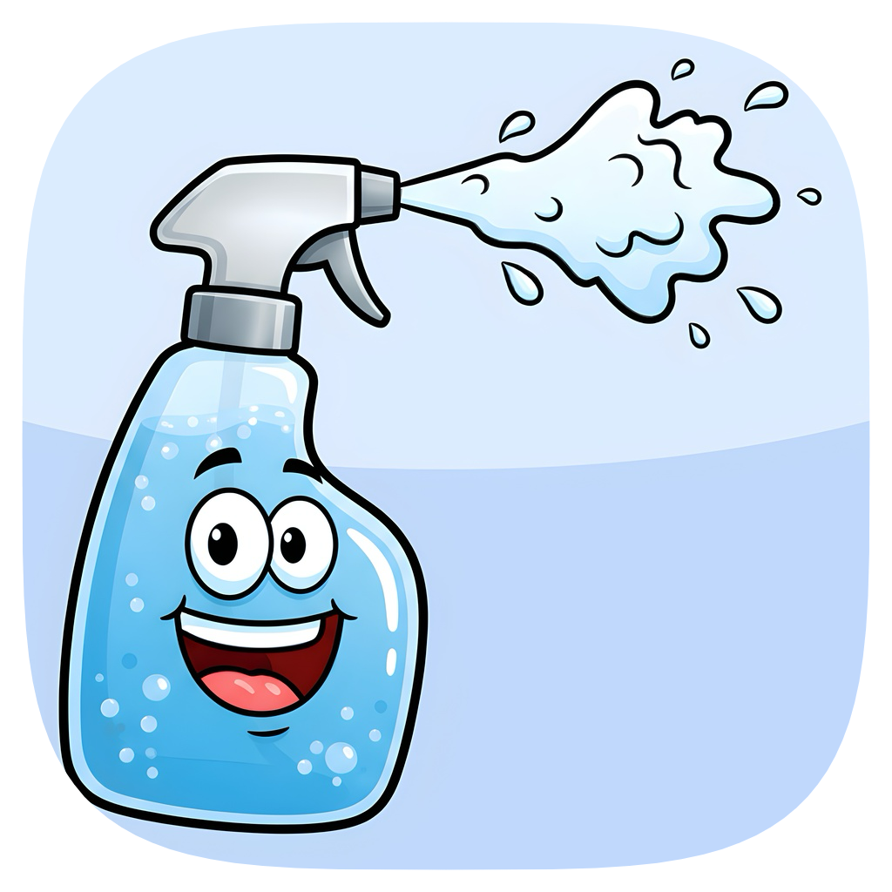

# Cleanable

A lightweight macOS menu bar app that lets you toggle keyboard input with a customizable shortcut.
No more unwanted keystrokes while cleaning your MacBook's keyboard!

## Features

- **Quick Lock/Unlock** - Toggle keyboard input with a simple shortcut
- **Customizable Shortcut** - Customize the dedicated shortcut to your liking
- **Menu Bar Integration** - Minimal menu bar setup with a keyboard lock status indicator
- **Lightweight** - Minimal resource usage

## Requirements

- macOS 15.0 or later
- Accessibility permissions (required for keyboard monitoring)

## Installation

1. Download the latest release
2. Move Cleanable.app to your `Applications` folder
3. Try to open the app → Gatekeeper will prevent launch
4. Open System Settings → Privacy & Security; scroll all the way down; click on 'Open Anyway'
5. Grant Accessibility permissions when promted
6. Restart the app

## Usage

### Toggling keyboard input

- Click the menu bar icon and select "Lock keyboard" / "Unlock keyboard"
- Or use your configured keyboard shortcut (default: `⌃⌘⌥L`)

The menu bar icon reflects the current lock status:

- 🔓 Unlocked (open lock icon)
- 🔒 Locked (closed lock icon)

### Configuring the shortcut

1. Click the menu bar icon
2. Select "Configure shortcut..."
3. Press your desired key combination
4. Click "Save"

A shortcut must contain at least one modifier key.
